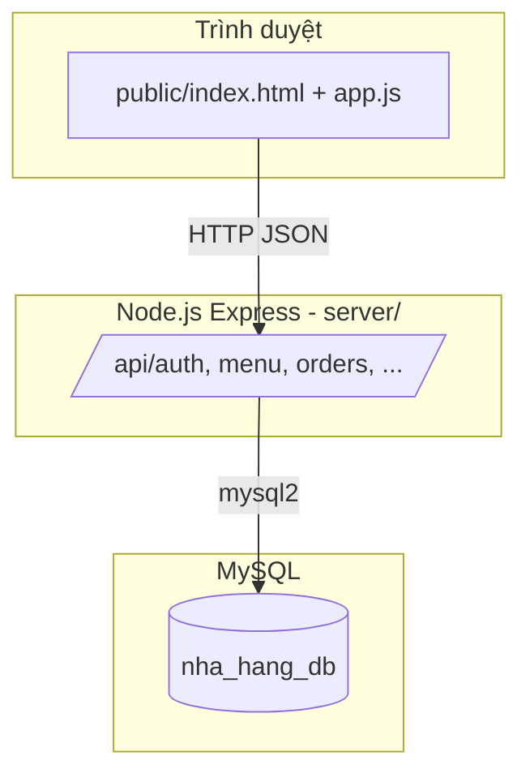
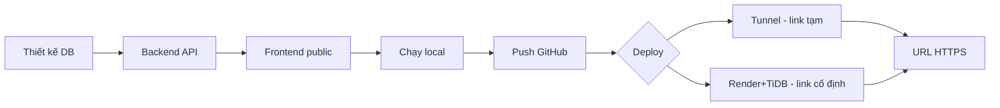

# Quy trình làm web — Phở Hà Nội (Quản lý F&B)

**Phiên bản:** 1.0  
**Dự án:** Phở Hà Nội — Hệ thống quản lý nhà hàng  
**Repo GitHub:** https://github.com/dukthuak/oder_code  

Tài liệu này mô tả **toàn bộ quy trình** từ thiết kế đến khi có **một đường link web** truy cập được trên Internet.

---

## Mục lục

1. [Kết quả cuối cùng là gì?](#1-kết-quả-cuối-cùng-là-gì)
2. [Kiến trúc hệ thống](#2-kiến-trúc-hệ-thống)
3. [Công nghệ sử dụng](#3-công-nghệ-sử-dụng)
4. [Cấu trúc thư mục dự án](#4-cấu-trúc-thư-mục-dự-án)
5. [Quy trình làm từng bước](#5-quy-trình-làm-từng-bước)
6. [Chạy web trên máy (local)](#6-chạy-web-trên-máy-local)
7. [Đưa web ra Internet (deploy)](#7-đưa-web-ra-internet-deploy)
8. [Đổi tên đường link (ví dụ phohanoi)](#8-đổi-tên-đường-link-ví-dụ-phohanoi)
9. [Tài khoản demo & kiểm tra](#9-tài-khoản-demo--kiểm-tra)
10. [Tài liệu liên quan](#10-tài-liệu-liên-quan)
11. [Link tải tài liệu](#11-link-tải-tài-liệu)

---

## 1. Kết quả cuối cùng là gì?

Sau khi hoàn thành quy trình, bạn có:

| Thành phần | Mô tả |
|------------|--------|
| **Giao diện web** | Trang đăng nhập, quản lý bàn, order, bếp, kho, báo cáo, chat AI |
| **API backend** | Node.js + Express, các endpoint `/api/*` |
| **Cơ sở dữ liệu** | MySQL `nha_hang_db` — bảng, view, stored procedure |
| **Đường link public** | URL HTTPS để mở từ trình duyệt (điện thoại, máy khác) |

**Ví dụ link đã dùng (tunnel tạm):**

```text
https://designation-potatoes-deutschland-receiver.trycloudflare.com
```

**Link cố định hơn (sau deploy Render):**

```text
https://pho-ha-noi.onrender.com
```
(hoặc đổi tên service thành `phohanoi` → `https://phohanoi.onrender.com`)

---

## 2. Kiến trúc hệ thống



**Luồng nghiệp vụ chính:**

```text
Đăng nhập → Chọn chi nhánh → Bàn & Order → Gọi món → Bếp xử lý
→ Thanh toán → Trừ kho → Báo cáo / AI gợi ý
```

---

## 3. Công nghệ sử dụng

| Lớp | Công nghệ | Ghi chú |
|-----|-----------|---------|
| Frontend | HTML, CSS, JavaScript thuần | Thư mục `public/`, không cần build |
| Backend | Node.js 18+, Express 4 | Thư mục `server/` |
| Database | MySQL 8+ | File SQL trong `database/` |
| Auth | bcryptjs + JWT (middleware) | `server/middleware/auth.js` |
| Deploy web | Render / Cloudflare Tunnel | File `render.yaml` |
| Deploy DB cloud | TiDB Cloud / MySQL local | Biến `DATABASE_URL` |

---

## 4. Cấu trúc thư mục dự án

```text
pho_ha_noi/
├── database/           # Script SQL: schema, seed, view, SP, AI
│   ├── 01_schema.sql
│   ├── 02_seed.sql
│   ├── 03_views.sql …
├── docs/               # Tài liệu (file này nằm ở đây)
├── public/             # Giao diện web
│   ├── index.html
│   ├── css/
│   └── js/app.js
├── server/             # Backend API
│   ├── server.js       # Điểm vào, phục vụ cả API + static
│   ├── config/db.js    # Kết nối MySQL
│   ├── routes/         # auth, menu, orders, inventory, …
│   ├── middleware/
│   ├── scripts/
│   │   ├── setup-db.js         # Tạo DB local
│   │   └── import-cloud-db.js  # Import lên DB cloud
│   └── package.json
├── scripts/
│   ├── tunnel-public.ps1       # Mở link public nhanh
│   └── setup-render-tidb.ps1
└── render.yaml         # Cấu hình deploy Render
```

---

## 5. Quy trình làm từng bước

### Bước 1 — Thiết kế & tạo cơ sở dữ liệu

1. Phân tích nghiệp vụ nhà hàng (bàn, order, bếp, kho, thanh toán…).
2. Vẽ mô hình ER → chuyển thành bảng MySQL (`database/01_schema.sql`).
3. Thêm dữ liệu mẫu (`02_seed.sql`), view báo cáo (`03_views.sql`), stored procedure (`05_procedures.sql`), bảng AI (`08_ai.sql`).

**Lệnh thiết lập DB trên máy:**

```powershell
cd d:\ducthuan\pho_ha_noi\server
copy .env.example .env
# Sửa .env: mật khẩu MySQL root
npm install
npm run setup-db
```

### Bước 2 — Xây backend API (Node.js)

1. Tạo project Express trong `server/`.
2. Kết nối MySQL qua `mysql2` (`config/db.js`).
3. Viết route theo module: `auth`, `menu`, `tables`, `orders`, `inventory`, `reports`, `reservations`, `permissions`, `ai`.
4. Middleware xác thực & phân quyền theo vai trò: `admin`, `thu_ngan`, `phuc_vu`, `bep`, `kho`.
5. Phục vụ file tĩnh từ `public/` và route SPA `GET *` → `index.html`.

**File trung tâm:** `server/server.js`

### Bước 3 — Xây giao diện web (Frontend)

1. Trang đăng nhập + layout dashboard (`public/index.html`).
2. JavaScript gọi API (`public/js/app.js`): đăng nhập, bàn, order, bếp, kho, AI chat…
3. CSS giao diện (`public/css/style.css`, `chat.css`).
4. Ẩn/hiện menu theo quyền từng vai trò.

### Bước 4 — Kiểm thử trên máy

1. Bật MySQL (Windows: MySQL Service).
2. `npm start` trong `server/`.
3. Mở `http://localhost:3001` (hoặc port trong `.env`).
4. Đăng nhập tài khoản demo → thử từng chức năng.

### Bước 5 — Đưa lên GitHub

```powershell
cd d:\ducthuan\pho_ha_noi
git init
git add .
git commit -m "Pho Ha Noi - quan ly nha hang"
git remote add origin https://github.com/TEN_BAN/oder_code.git
git push -u origin main
```

> **Lưu ý:** Không commit `server/.env` và `node_modules/` (đã có `.gitignore`).

### Bước 6 — Deploy ra link Internet

Xem [mục 7](#7-đưa-web-ra-internet-deploy) bên dưới.

---

## 6. Chạy web trên máy (local)

### Yêu cầu

- Windows 10/11
- [Node.js](https://nodejs.org/) 18 trở lên
- MySQL Server (cổng 3306)

### Các bước

| # | Việc cần làm | Lệnh / Hành động |
|---|--------------|------------------|
| 1 | Cài dependency | `cd server` → `npm install` |
| 2 | Cấu hình `.env` | Copy từ `.env.example`, điền mật khẩu MySQL |
| 3 | Tạo database | `npm run setup-db` |
| 4 | Chạy server | `npm start` |
| 5 | Mở trình duyệt | `http://localhost:3001` |

**Chi tiết:** xem `docs/HUONG_DAN_KET_NOI_MYSQL.md`

---

## 7. Đưa web ra Internet (deploy)

Có **3 hướng** (không bắt buộc Railway):

### Cách A — Demo nhanh (Cloudflare Tunnel) — ~2 phút

**Ưu:** Không cần đăng ký Render/TiDB; dùng MySQL trên máy.  
**Nhược:** URL random (`*.trycloudflare.com`); máy tắt là web tắt.

```powershell
cd d:\ducthuan\pho_ha_noi
.\scripts\tunnel-public.ps1
```

Copy URL in ra (dạng `https://....trycloudflare.com`) → chia sẻ.

---

### Cách B — Web ổn định: Render + TiDB (khuyến nghị)

**Ưu:** URL cố định `https://ten-service.onrender.com`; không phụ thuộc máy bạn.  
**Nhược:** Cần đăng ký 2 dịch vụ free; app Render có thể “ngủ” khi không ai truy cập.

| Bước | Việc làm | Link |
|------|----------|------|
| 1 | Tạo MySQL free trên TiDB Cloud | https://tidbcloud.com |
| 2 | Import schema | `npm run import-cloud-db` (xem script) |
| 3 | Deploy web trên Render | https://dashboard.render.com → Blueprint → repo `oder_code` |
| 4 | Gán biến `DATABASE_URL` | Chuỗi kết nối TiDB |
| 5 | Mở URL Render | Ví dụ `https://pho-ha-noi.onrender.com` |

**Chi tiết từng click:** `docs/HUONG_DAN_DEPLOY_RENDER_TIDB.md`

---

### Cách C — Railway (nếu còn credit)

**Chi tiết:** `docs/HUONG_DAN_DEPLOY.md`

---

### So sánh nhanh

| Tiêu chí | Tunnel | Render + TiDB | Railway |
|----------|--------|---------------|---------|
| Chi phí | Free | Free (giới hạn) | Free (credit/tháng) |
| URL cố định | Không | Có | Có |
| Cần máy bật | Có | Không | Không |
| Setup | Dễ nhất | Trung bình | Trung bình |

---

## 8. Đổi tên đường link (ví dụ phohanoi)

| Loại link | Đổi thành `phohanoi`? | Cách làm |
|-----------|------------------------|----------|
| `*.trycloudflare.com` | **Không** | Cloudflare tự đặt tên ngẫu nhiên |
| Render | **Có** (gần đúng) | Sửa `name: phohanoi` trong `render.yaml` → deploy lại |
| Domain riêng | **Có** | Mua `phohanoi.vn` + Cloudflare DNS + Named Tunnel |

---

## 9. Tài khoản demo & kiểm tra

### Tài khoản (sau `setup-db` hoặc `import-cloud-db`)

| Email | Vai trò | Mật khẩu |
|-------|---------|----------|
| admin@nhang.com | Quản trị | password123 |
| thungan@nhang.com | Thu ngân | password123 |
| phucvu@nhang.com | Phục vụ | password123 |
| bep@nhang.com | Bếp | password123 |
| kho@nhang.com | Kho | password123 |

### Kiểm tra API hoạt động

```text
GET https://YOUR-DOMAIN/api/health
```

Kết quả đúng:

```json
{"status":"ok","service":"nha-hang-api"}
```

---

## 10. Tài liệu liên quan

| File | Nội dung |
|------|----------|
| `TAI-LIEU-HE-THONG.md` | Chức năng F01–F14, bảng CSDL |
| `TAI-LIEU-CHUC-NANG-WEB.md` | Màn hình web, API từng trang |
| `MO-TA-CHUC-NANG.md` | Phạm vi bài toán |
| `HUONG_DAN_KET_NOI_MYSQL.md` | Cài MySQL & chạy local |
| `HUONG_DAN_DEPLOY.md` | Deploy Railway |
| `HUONG_DAN_DEPLOY_RENDER_TIDB.md` | Deploy Render + TiDB |
| `BAI_TAP_GIAI_THICH.md` | Giải thích bài tập |

---

## 11. Link tải tài liệu

### Tải từ GitHub (khuyến nghị)

Thay `main` bằng nhánh bạn đang dùng nếu khác.

| Tài liệu | Link tải trực tiếp |
|----------|-------------------|
| **Quy trình làm web (file này)** | https://raw.githubusercontent.com/dukthuak/oder_code/main/docs/QUY-TRINH-LAM-WEB-PHO-HA-NOI.md |
| Mục lục tất cả docs | https://raw.githubusercontent.com/dukthuak/oder_code/main/docs/README.md |
| Deploy Render + TiDB | https://raw.githubusercontent.com/dukthuak/oder_code/main/docs/HUONG_DAN_DEPLOY_RENDER_TIDB.md |
| Hướng dẫn MySQL local | https://raw.githubusercontent.com/dukthuak/oder_code/main/docs/HUONG_DAN_KET_NOI_MYSQL.md |
| Tài liệu hệ thống | https://raw.githubusercontent.com/dukthuak/oder_code/main/docs/TAI-LIEU-HE-THONG.md |

**Cách tải:** mở link → Ctrl+S (Lưu trang) hoặc chuột phải → **Save as**.  
**In PDF:** mở file `.md` bằng VS Code / Word → In ra PDF.

### Tải từ máy local

```text
d:\ducthuan\pho_ha_noi\docs\QUY-TRINH-LAM-WEB-PHO-HA-NOI.md
```

### Xem trên GitHub (có định dạng)

https://github.com/dukthuak/oder_code/tree/main/docs

---

## Sơ đồ tổng hợp — Từ code đến link web



---

*Tài liệu thuộc dự án Phở Hà Nội — cập nhật theo repo `dukthuak/oder_code`.*
