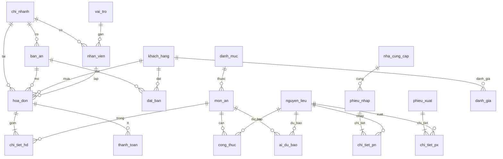

# Tài liệu hệ thống — Phở Hà Nội (Quản lý F&B)

Tài liệu mô tả **các chức năng dùng để làm gì**, **bảng cơ sở dữ liệu**, view, stored procedure và mối liên hệ với ứng dụng web.

**Tài liệu liên quan:**

| File | Nội dung |
|------|----------|
| [`TAI-LIEU-CHUC-NANG-WEB.md`](TAI-LIEU-CHUC-NANG-WEB.md) | Chi tiết từng màn hình web, API, phân quyền |
| [`MO-TA-CHUC-NANG.md`](MO-TA-CHUC-NANG.md) | Phạm vi bài toán, mã chức năng F01–F14 |
| [`MO-HINH-ER.md`](MO-HINH-ER.md) | Mô hình ER tóm tắt |
| [`MO-HINH-QUAN-HE.md`](MO-HINH-QUAN-HE.md) | Quan hệ giữa các bảng |

**Mã nguồn CSDL:** `database/01_schema.sql` (bảng), `03_views.sql`, `05_procedures.sql`, `08_ai.sql`, `02_seed.sql` (dữ liệu mẫu).

---

## 1. Tổng quan hệ thống

Hệ thống quản lý nhà hàng **Phở Hà Nội** hỗ trợ nhiều chi nhánh, gồm:

- **CSDL MySQL** (`nha_hang_db`) — lưu trữ nghiệp vụ, báo cáo, AI
- **API Node.js / Express** (`server/`) — xử lý nghiệp vụ, xác thực, phân quyền
- **Web** (`public/`) — giao diện cho nhân viên (order, bếp, kho, báo cáo, chat AI)

**Luồng kinh doanh chính:**

```
Đặt bàn (tuỳ chọn) → Mở bàn / Tạo hóa đơn → Gọi món → Bếp chế biến
→ Phục vụ → Thu ngân thanh toán → Trừ kho (công thức) → Tích điểm khách
```

---

## 2. Các chức năng — Dùng để làm gì?

Mỗi chức năng gắn mã **Fxx**, bảng CSDL liên quan và mức triển khai trên web.

| Mã | Tên chức năng | Dùng để làm gì? | Bảng / đối tượng CSDL chính | Trên web |
|----|---------------|-----------------|-----------------------------|----------|
| **F01** | Quản lý chi nhánh | Lưu thông tin từng cửa hàng: tên, địa chỉ, giờ mở cửa, trạng thái hoạt động. Là đơn vị gắn bàn, nhân viên, hóa đơn. | `chi_nhanh` | Dữ liệu nền (chi nhánh khi đăng nhập); chat AI tra cứu |
| **F02** | Nhân viên & phân quyền | Quản lý tài khoản làm việc, gán **vai trò** (admin, thu ngân, phục vụ, bếp, kho), đăng nhập, kiểm soát ai được làm gì. | `vai_tro`, `nhan_vien` | Đăng nhập; mục **Phân quyền** (chỉ admin) |
| **F03** | Quản lý thực đơn | Danh mục món (khai vị, món chính…), tên món, giá bán, đơn vị, trạng thái còn/hết. | `danh_muc`, `mon_an` | Trang **Thực đơn**; gợi ý chat AI |
| **F04** | Công thức & nguyên liệu | Định mức nguyên liệu cho từng món (bao nhiêu kg thịt, bánh phở…). Cơ sở **trừ kho** khi bán món. | `nguyen_lieu`, `cong_thuc` | Nền tảng kho; không có màn CRUD riêng trên web |
| **F05** | Quản lý bàn | Danh sách bàn theo chi nhánh, sức chứa, trạng thái trống / đang dùng / đặt trước. | `ban_an` | Trang **Bàn & Order** (lưới bàn) |
| **F06** | Đặt bàn | Khách đặt trước: thời gian, số người, bàn, xác nhận hoặc hủy. | `dat_ban`, `khach_hang`, `ban_an` | Trang **Đặt bàn** |
| **F07** | Gọi món (Order) | Tạo **hóa đơn** gắn bàn, thêm **chi tiết món**, theo dõi trạng thái chế biến từng món. | `hoa_don`, `chi_tiet_hd` | **Bàn & Order**, **Bếp** |
| **F08** | Thanh toán | Ghi nhận thanh toán (tiền mặt, chuyển khoản, QR, thẻ), đóng hóa đơn, cộng điểm khách. | `thanh_toan`, `hoa_don`, `khach_hang` | Nút thanh toán trên order (thu ngân/admin) |
| **F09** | Quản lý kho | Theo dõi **tồn** nguyên liệu, ngưỡng tối thiểu, **cảnh báo** hết/sắp hết; phiếu xuất khi dùng. | `nguyen_lieu`, `phieu_xuat`, `chi_tiet_px` | Trang **Kho**; dashboard cảnh báo |
| **F10** | Nhà cung cấp & phiếu nhập | Mua nguyên liệu từ NCC, tạo phiếu nhập, cập nhật tồn kho khi hoàn tất. | `nha_cung_cap`, `phieu_nhap`, `chi_tiet_pn` | API nhập kho (`POST /api/inventory/import`) |
| **F11** | Khách hàng & tích điểm | Lưu hồ sơ khách, hạng thành viên (đồng → bạch kim), điểm tích lũy sau thanh toán. | `khach_hang` | Dashboard VIP; AI gợi ý theo lịch sử |
| **F12** | Đánh giá | Khách chấm điểm / nhận xét món hoặc dịch vụ sau khi dùng bữa. | `danh_gia` | Có trong CSDL; chưa có màn hình web riêng |
| **F13** | Báo cáo | Doanh thu theo ngày, món bán chạy, tồn kho, dashboard tổng hợp. | View `vw_mon_ban_chay`, `vw_ton_kho_canh_bao`; SP `sp_bao_cao_doanh_thu` | **Tổng quan**, **Báo cáo** |
| **F14** | AI hỗ trợ | Chat trợ lý (hướng dẫn, kho, doanh thu, bếp…), gợi ý món, dự báo nhu cầu, cảnh báo tồn bất thường. | `ai_du_bao`; SP `sp_ai_*` | Widget **Chat AI**, trang **AI Insights** |

---

## 3. Tác nhân (vai trò) — Ai dùng chức năng nào?

| Vai trò (`ten_vt`) | Mục đích | Chức năng chính trên web |
|--------------------|----------|---------------------------|
| `admin` | Quản trị toàn hệ thống | Tất cả trang, **Phân quyền**, sửa thực đơn, báo cáo, kho, AI |
| `thu_ngan` | Thu tiền, order | Bàn & order, thanh toán, đặt bàn, báo cáo, AI |
| `phuc_vu` | Phục vụ khách tại bàn | Bàn & order (không thanh toán), đặt bàn, thực đơn, chat AI |
| `bep` | Chế biến | Bếp (hàng đợi món), tổng quan, chat AI |
| `kho` | Quản lý nguyên liệu | Kho, tổng quan, chat AI (cảnh báo kho) |

---

## 4. Sơ đồ quan hệ bảng (tóm tắt)



---

## 5. Bảng cơ sở dữ liệu — Chi tiết

Cơ sở dữ liệu: **`nha_hang_db`** (MySQL 8+, utf8mb4).

### 5.1. Nhóm tổ chức & người dùng

#### `chi_nhanh` (F01 — Chi nhánh)

| Cột | Kiểu | Mô tả |
|-----|------|--------|
| `ma_cn` | INT PK AI | Mã chi nhánh |
| `ten_cn` | VARCHAR(120) UNIQUE | Tên chi nhánh |
| `dia_chi` | VARCHAR(255) | Địa chỉ |
| `sdt` | VARCHAR(20) | Số điện thoại |
| `gio_mo_cua` | VARCHAR(50) | Giờ mở cửa (vd: 07:00-22:00) |
| `trang_thai` | ENUM | `hoat_dong` / `tam_dong` |

**Dùng để:** Phân tách dữ liệu theo cửa hàng; nhân viên và bàn gắn một chi nhánh.

---

#### `vai_tro` (F02 — Vai trò)

| Cột | Kiểu | Mô tả |
|-----|------|--------|
| `ma_vt` | INT PK AI | Mã vai trò |
| `ten_vt` | VARCHAR(50) UNIQUE | Mã vai trò hệ thống: `admin`, `thu_ngan`, `phuc_vu`, `bep`, `kho` |
| `mo_ta` | VARCHAR(255) | Mô tả tiếng Việt |

**Dùng để:** Phân quyền chức năng web và API.

---

#### `nhan_vien` (F02 — Nhân viên)

| Cột | Kiểu | Mô tả |
|-----|------|--------|
| `ma_nv` | INT PK AI | Mã nhân viên |
| `ma_cn` | INT FK → `chi_nhanh` | Chi nhánh làm việc |
| `ma_vt` | INT FK → `vai_tro` | Vai trò |
| `ho_ten` | VARCHAR(100) | Họ tên |
| `email` | VARCHAR(120) UNIQUE | Email đăng nhập |
| `mat_khau_hash` | VARCHAR(255) | Mật khẩu (bcrypt) |
| `sdt` | VARCHAR(20) | Điện thoại |
| `ngay_vao_lam` | DATE | Ngày vào làm |
| `trang_thai` | ENUM | `lam_viec` / `nghi` |

**Dùng để:** Đăng nhập web; ghi nhận người lập hóa đơn, thanh toán, nhập kho.

---

### 5.2. Khách hàng & thực đơn

#### `khach_hang` (F11)

| Cột | Kiểu | Mô tả |
|-----|------|--------|
| `ma_kh` | INT PK AI | Mã khách |
| `ho_ten` | VARCHAR(100) | Họ tên |
| `email` | VARCHAR(120) UNIQUE | Email (có thể NULL) |
| `sdt` | VARCHAR(20) | Điện thoại |
| `diem_tich_luy` | INT ≥ 0 | Điểm tích lũy |
| `hang_thanh_vien` | ENUM | `dong`, `bac`, `vang`, `bach_kim` |

**Dùng để:** Đặt bàn, gắn hóa đơn, cộng điểm khi thanh toán, AI gợi ý món.

---

#### `danh_muc` (F03)

| Cột | Kiểu | Mô tả |
|-----|------|--------|
| `ma_dm` | INT PK AI | Mã danh mục |
| `ten_dm` | VARCHAR(80) UNIQUE | Tên (Khai vị, Món chính, Đồ uống…) |
| `mo_ta` | VARCHAR(255) | Mô tả |

---

#### `mon_an` (F03)

| Cột | Kiểu | Mô tả |
|-----|------|--------|
| `ma_mon` | INT PK AI | Mã món |
| `ma_dm` | INT FK → `danh_muc` | Danh mục |
| `ten_mon` | VARCHAR(120) UNIQUE | Tên món |
| `gia_ban` | DECIMAL(12,2) | Giá bán |
| `don_vi` | VARCHAR(30) | Đơn vị (tô, phần, ly…) |
| `mo_ta` | TEXT | Mô tả món |
| `hinh_anh` | VARCHAR(255) | Đường ảnh (tuỳ chọn) |
| `trang_thai` | ENUM | `con` (còn) / `het` (hết) |

**Dùng để:** Hiển thị thực đơn, thêm vào order, báo cáo bán chạy.

---

### 5.3. Kho & công thức

#### `nguyen_lieu` (F04, F09)

| Cột | Kiểu | Mô tả |
|-----|------|--------|
| `ma_nl` | INT PK AI | Mã nguyên liệu |
| `ten_nl` | VARCHAR(120) UNIQUE | Tên (bánh phở, thịt bò…) |
| `don_vi` | VARCHAR(30) | kg, thùng… |
| `ton_kho` | DECIMAL(12,3) | Tồn hiện tại |
| `ton_toi_thieu` | DECIMAL(12,3) | Ngưỡng cảnh báo |
| `gia_nhap` | DECIMAL(12,2) | Giá nhập |

**Dùng để:** Quản lý tồn, cảnh báo, phiếu nhập/xuất.

---

#### `cong_thuc` (F04)

| Cột | Kiểu | Mô tả |
|-----|------|--------|
| `ma_mon` | INT PK, FK → `mon_an` | Món |
| `ma_nl` | INT PK, FK → `nguyen_lieu` | Nguyên liệu |
| `so_luong` | DECIMAL(10,3) | Định mức mỗi phần món |

**Dùng để:** Tính nguyên liệu cần trừ khi bán món (trigger / nghiệp vụ kho).

---

#### `nha_cung_cap` (F10)

| Cột | Kiểu | Mô tả |
|-----|------|--------|
| `ma_ncc` | INT PK AI | Mã NCC |
| `ten_ncc` | VARCHAR(120) | Tên nhà cung cấp |
| `sdt`, `dia_chi` | VARCHAR | Liên hệ |

---

#### `phieu_nhap` (F10)

| Cột | Kiểu | Mô tả |
|-----|------|--------|
| `ma_pn` | INT PK AI | Mã phiếu nhập |
| `ma_ncc` | INT FK | Nhà cung cấp |
| `ma_nv` | INT FK | Nhân viên lập |
| `ngay_nhap` | DATETIME | Ngày nhập |
| `tong_tien` | DECIMAL(14,2) | Tổng tiền |
| `trang_thai` | ENUM | `nhap`, `hoan_tat`, `huy` |

---

#### `chi_tiet_pn` (F10)

| Cột | Kiểu | Mô tả |
|-----|------|--------|
| `ma_ctpn` | INT PK AI | Mã dòng |
| `ma_pn` | INT FK → `phieu_nhap` | Phiếu nhập |
| `ma_nl` | INT FK | Nguyên liệu |
| `so_luong` | DECIMAL(12,3) | Số lượng nhập |
| `don_gia` | DECIMAL(12,2) | Đơn giá |

**Dùng để:** Tăng `ton_kho` khi gọi `sp_hoan_tat_phieu_nhap`.

---

#### `phieu_xuat` (F09)

| Cột | Kiểu | Mô tả |
|-----|------|--------|
| `ma_px` | INT PK AI | Mã phiếu xuất |
| `ma_nv` | INT FK | Người lập |
| `ma_cn` | INT FK | Chi nhánh |
| `ly_do` | VARCHAR(255) | Lý do xuất |
| `ngay_xuat` | DATETIME | Ngày xuất |

---

#### `chi_tiet_px` (F09)

| Cột | Kiểu | Mô tả |
|-----|------|--------|
| `ma_ctpx` | INT PK AI | Mã dòng |
| `ma_px` | INT FK | Phiếu xuất |
| `ma_nl` | INT FK | Nguyên liệu |
| `so_luong` | DECIMAL(12,3) | Số lượng xuất |

---

### 5.4. Bàn, đặt chỗ, bán hàng

#### `ban_an` (F05)

| Cột | Kiểu | Mô tả |
|-----|------|--------|
| `ma_ban` | INT PK AI | Mã bàn |
| `ma_cn` | INT FK | Chi nhánh |
| `so_ban` | VARCHAR(20) | Số bàn (hiển thị) |
| `suc_chua` | INT | Số chỗ |
| `trang_thai` | ENUM | `trong`, `dang_dung`, `dat_truoc` |

**Dùng để:** Chọn bàn mở order; đồng bộ khi có hóa đơn đang mở.

---

#### `dat_ban` (F06)

| Cột | Kiểu | Mô tả |
|-----|------|--------|
| `ma_dat` | INT PK AI | Mã đặt bàn |
| `ma_kh` | INT FK (nullable) | Khách |
| `ma_ban` | INT FK | Bàn |
| `ma_cn` | INT FK | Chi nhánh |
| `ngay_gio` | DATETIME | Thời gian đặt |
| `so_nguoi` | INT | Số khách |
| `trang_thai` | ENUM | `cho`, `xac_nhan`, `huy`, `hoan_thanh` |
| `ghi_chu` | VARCHAR(255) | Ghi chú |

---

#### `hoa_don` (F07, F08)

| Cột | Kiểu | Mô tả |
|-----|------|--------|
| `ma_hd` | INT PK AI | Mã hóa đơn |
| `ma_ban` | INT FK (nullable) | Bàn |
| `ma_nv` | INT FK | NV lập |
| `ma_kh` | INT FK (nullable) | Khách |
| `ma_cn` | INT FK | Chi nhánh |
| `ngay_lap` | DATETIME | Thời gian lập |
| `trang_thai` | ENUM | `mo` → `dang_che_bien` → `cho_thanh_toan` → `da_thanh_toan` / `huy` |
| `tong_tien` | DECIMAL(14,2) | Tổng tiền món |
| `giam_gia` | DECIMAL(14,2) | Giảm giá |

**Dùng để:** Order tại bàn; báo cáo doanh thu khi `da_thanh_toan`.

---

#### `chi_tiet_hd` (F07)

| Cột | Kiểu | Mô tả |
|-----|------|--------|
| `ma_ct` | INT PK AI | Mã dòng |
| `ma_hd` | INT FK → `hoa_don` | Hóa đơn |
| `ma_mon` | INT FK | Món |
| `so_luong` | INT | Số lượng |
| `don_gia` | DECIMAL(12,2) | Đơn giá tại thời điểm order |
| `ghi_chu` | VARCHAR(255) | Ghi chú món |
| `trang_thai_mon` | ENUM | `cho`, `dang_nau`, `xong`, `huy` |

**Dùng để:** Bếp cập nhật trạng thái; tính tổng hóa đơn.

---

#### `thanh_toan` (F08)

| Cột | Kiểu | Mô tả |
|-----|------|--------|
| `ma_tt` | INT PK AI | Mã thanh toán |
| `ma_hd` | INT FK | Hóa đơn |
| `hinh_thuc` | ENUM | `tien_mat`, `chuyen_khoan`, `qr`, `the` |
| `so_tien` | DECIMAL(14,2) | Số tiền |
| `ngay_tt` | DATETIME | Thời gian |
| `ma_nv` | INT FK | Thu ngân |

---

### 5.5. Đánh giá & AI

#### `danh_gia` (F12)

| Cột | Kiểu | Mô tả |
|-----|------|--------|
| `ma_dg` | INT PK AI | Mã đánh giá |
| `ma_kh` | INT FK | Khách |
| `ma_mon` | INT FK (nullable) | Món |
| `ma_hd` | INT FK (nullable) | Hóa đơn |
| `diem` | TINYINT 1–5 | Điểm |
| `noi_dung` | TEXT | Nội dung |
| `ngay_dg` | DATETIME | Ngày đánh giá |

---

#### `ai_du_bao` (F14)

| Cột | Kiểu | Mô tả |
|-----|------|--------|
| `ma_ai` | INT PK AI | Mã bản ghi |
| `loai` | ENUM | `nhu_cau_mon`, `canh_bao_ton`, `goi_y`, `khac` |
| `ma_mon` | INT FK (nullable) | Món liên quan |
| `ma_nl` | INT FK (nullable) | Nguyên liệu liên quan |
| `gia_tri` | DECIMAL(14,4) | Giá trị số (dự báo…) |
| `noi_dung` | TEXT | Mô tả / insight |
| `ngay_tao` | DATETIME | Thời gian tạo |

**Dùng để:** Lưu kết quả chạy AI (dự báo, cảnh báo kho); hiển thị trang AI Insights.

---

## 6. View (khung nhìn) — Dùng để làm gì?

| View | File | Mục đích |
|------|------|----------|
| `vw_mon_ban_chay` | `03_views.sql` | Tổng số lượng & doanh thu từng món từ hóa đơn đã thanh toán → **món bán chạy**, dashboard |
| `vw_ton_kho_canh_bao` | `03_views.sql` | Nguyên liệu có `ton_kho ≤ ton_toi_thieu`, phân loại `het_hang` / `sap_het` → **cảnh báo kho** |
| `vw_chi_tiet_hoa_don` | `03_views.sql` | Chi tiết món kèm tên, thành tiền → API order |
| `vw_ban_dang_phuc_vu` | `03_views.sql` | Bàn đang dùng kèm hóa đơn mở → theo dõi phục vụ |

---

## 7. Stored procedure — Dùng để làm gì?

| Procedure | Mục đích nghiệp vụ |
|-----------|---------------------|
| `sp_tao_hoa_don` | Tạo hóa đơn mới, đánh dấu bàn `dang_dung` |
| `sp_them_mon_hd` | Thêm món vào hóa đơn, cập nhật `tong_tien`, trạng thái HD |
| `sp_thanh_toan` | Ghi `thanh_toan`, đóng HD, cộng điểm & hạng khách |
| `sp_bao_cao_doanh_thu` | Báo cáo doanh thu theo ngày (lọc chi nhánh) |
| `sp_hoan_tat_phieu_nhap` | Hoàn tất phiếu nhập → tăng tồn kho |
| `sp_ai_du_bao_nhu_cau` | Sinh dự báo nhu cầu món → `ai_du_bao` |
| `sp_ai_goi_y_mon` | Gợi ý món theo khách / phổ biến → chat AI |
| `sp_ai_phat_hien_bat_thuong` | Phát hiện tồn kho bất thường → AI |

---

## 8. Ánh xạ: Chức năng web ↔ Bảng

| Trang web | Chức năng | Bảng đọc/ghi chính |
|-----------|-----------|-------------------|
| Đăng nhập | F02 | `nhan_vien`, `vai_tro`, `chi_nhanh` |
| Tổng quan | F13, F09, F03 | `hoa_don`, view `vw_*`, `khach_hang` |
| Bàn & Order | F05, F07, F08 | `ban_an`, `hoa_don`, `chi_tiet_hd`, `mon_an` |
| Bếp | F07 | `chi_tiet_hd`, `hoa_don`, `mon_an` |
| Thực đơn | F03 | `mon_an`, `danh_muc` |
| Kho | F09, F04 | `nguyen_lieu`, view `vw_ton_kho_canh_bao` |
| Đặt bàn | F06 | `dat_ban`, `khach_hang`, `ban_an` |
| Báo cáo | F13 | `hoa_don`, SP `sp_bao_cao_doanh_thu` |
| Phân quyền | F02 | `nhan_vien`, `vai_tro` |
| AI / Chat | F14 | `mon_an`, `ai_du_bao`, SP `sp_ai_*`, nhiều bảng tra cứu |

---

## 9. Thứ tự triển khai CSDL

| Bước | File | Nội dung |
|------|------|----------|
| 1 | `01_schema.sql` | Tạo bảng |
| 2 | `02_seed.sql` | Dữ liệu mẫu |
| 3 | `03_views.sql` | View |
| 4 | `04_functions.sql` | Hàm (tính tổng HD, hạng KH…) |
| 5 | `05_procedures.sql` | Stored procedure |
| 6 | `06_triggers.sql` | Trigger (tự động hóa) |
| 7 | `07_permissions.sql` | User MySQL theo vai trò (tuỳ chọn) |
| 8 | `08_ai.sql` | Bảng `ai_du_bao` |

Chạy gộp: `node server/scripts/setup-db.js` (nếu đã cấu hình `.env`).

---

## 10. Ghi chú kỹ thuật

- **Chuẩn hóa:** Mô hình quan hệ 3NF; khóa ngoại đảm bảo toàn vẹn.
- **Phân quyền ứng dụng:** Theo `vai_tro.ten_vt` trên API và menu web (khác với user MySQL trong `07_permissions.sql`).
- **Chức năng có trong CSDL nhưng chưa có UI đầy đủ:** `danh_gia` (F12), CRUD chi nhánh/NCC trực tiếp trên web.

---

*Tài liệu hệ thống — dự án Phở Hà Nội. Cập nhật theo schema `database/01_schema.sql` và ứng dụng web hiện tại.*
